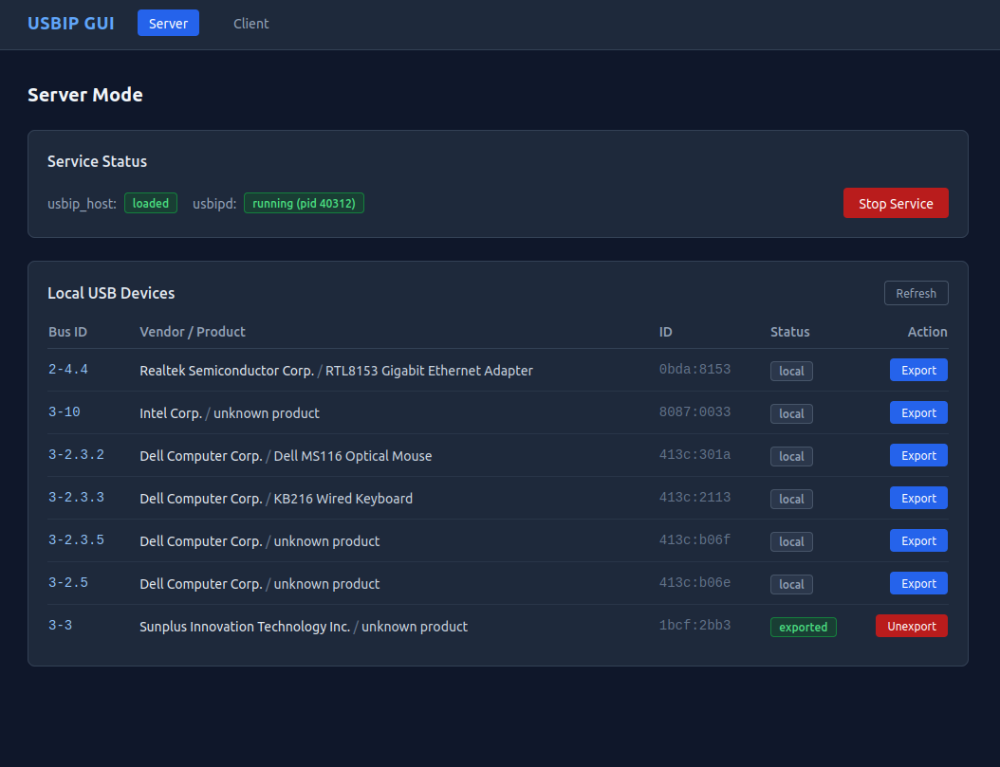
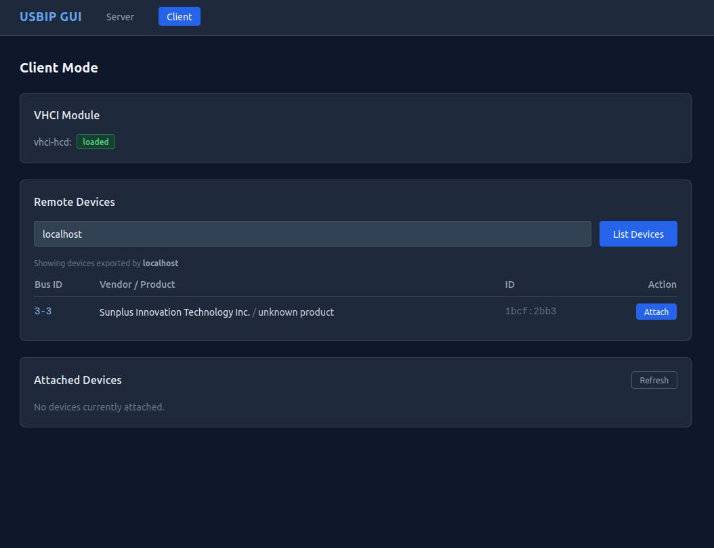

# USBIP GUI

A modern web-based graphical interface for managing USBIP (USB over IP) on Linux systems. This project provides an intuitive dashboard for both USBIP server and client operations, eliminating the need for command-line interactions.

## Table of Contents

- [What is USBIP?](#what-is-usbip)
- [Features](#features)
- [Requirements](#requirements)
- [Installation](#installation)
- [Installation as a Service](#installation-as-a-service)
- [Configuration](#configuration)
- [Usage](#usage)
- [Project Structure](#project-structure)
- [Development](#development)
- [Documentation & Resources](#documentation--resources)

## What is USBIP?

**USBIP (USB over IP)** is a Linux kernel subsystem that allows you to use USB devices remotely over a network as if they were physically connected to your computer. It consists of two main components:

- **USBIP Server**: Exposes local USB devices over the network, allowing remote clients to access them
- **USBIP Client**: Connects to a remote USBIP server and attaches remote USB devices to your system

### Key Use Cases

- Share USB devices across a network (printers, scanners, security tokens, etc.)
- Access USB devices from virtual machines or containers
- Centralize USB device management in data centers
- Remote device testing and development

### How It Works

USBIP operates at the kernel level (Linux kernel modules):
1. `usbip_core` - Core USBIP functionality
2. `usbip_host` - Server-side module for sharing USB devices
3. `vhci_hcd` - Virtual Host Controller Interface for client-side attachment

USB communication is tunneled over TCP/IP, maintaining compatibility with standard USB protocols.

## Features

- **Web-Based Interface**: Modern, responsive dashboard accessible from any web browser
- **USBIP Server Management**:
  - View daemon status and host module information
  - List available USB devices with detailed information (vendor ID, product ID, names)
  - Enable/disable device sharing
  
- **USBIP Client Management**:
  - Connect to remote USBIP servers
  - Browse remote devices
  - Attach/detach remote USB devices
  - View attached ports and connection status
  - Monitor virtual host controller interface (vhci) status

- **Real-time Status Updates**: Dynamic status monitoring for server and client operations
- **Async Architecture**: FastAPI-based async runtime for responsive interactions
- **Security**: Support for privilege escalation via sudo with passwordless configuration

## Requirements

- **Operating System**: Linux (USBIP is Linux-specific)
- **USBIP Command-line Tools**: Provided by `linux-tools` package
- **Python**: 3.10 or higher
- **Privileges**: Must run with root access or sudo privileges for USBIP operations

### Installing USBIP Tools

**Note**: The standalone `usbip` package is deprecated since kernel 3.17. USBIP tools are now provided by the kernel's `linux-tools` package.

#### Uninstall Deprecated Packages (if previously installed)

```bash
sudo apt-get remove --purge usbip* libusbip*
```

#### Install linux-tools

**Ubuntu/Debian**:
```bash
sudo apt-get install linux-tools-generic
```

This single package provides all necessary USBIP tools integrated with your kernel version.

### Python Dependencies

- FastAPI >= 0.110.0
- Uvicorn[standard] >= 0.27.0
- Jinja2 >= 3.1.3
- python-multipart >= 0.0.9
- pydantic-settings >= 2.2.0

## Installation

### 1. Clone the Repository

```bash
git clone https://github.com/yourusername/usbipgui.git
cd usbipgui
```

### 2. Create a Virtual Environment (Optional but Recommended)

```bash
python3 -m venv venv
source venv/bin/activate
```

### 3. Install Python Dependencies

```bash
pip install -r requirements.txt
```

### 4. Verify USBIP Installation

```bash
usbip --version
```

## Installation as a Service

To run USBIP GUI automatically at startup without requiring manual sudo commands, you can install it as a systemd service. This is the recommended approach for production use.

### Automated Installation

A provided installer script handles all the setup automatically:

```bash
sudo ./install.sh
```

The installer will:
- Create a dedicated `usbipgui` service user with appropriate permissions
- Install the application to `/opt/usbipgui`
- Set up a Python virtual environment with dependencies
- Configure sudoers rules for USBIP commands without password prompts
- Create and enable a systemd service for automatic startup
- Set up proper logging to `journalctl`

#### Start the Service

After installation, start the service:

```bash
sudo systemctl start usbipgui
```

#### Enable Autostart

The service is automatically enabled for startup. To verify:

```bash
sudo systemctl is-enabled usbipgui
# Output: enabled
```

#### Check Service Status

```bash
sudo systemctl status usbipgui
```

#### View Logs

```bash
# Real-time logs
sudo journalctl -u usbipgui -f

# Last 50 lines
sudo journalctl -u usbipgui -n 50

# Since last boot
sudo journalctl -u usbipgui -b
```

#### Access the Web Interface

Once the service is running, open your web browser and navigate to:

```
http://localhost:8080
```

**Tip**: If port 8080 conflicts with another service, you can specify a custom port by editing the systemd service file:

```bash
sudo nano /etc/systemd/system/usbipgui.service
# Change the port in the ExecStart line, then:
sudo systemctl daemon-reload
sudo systemctl restart usbipgui
```

### Manual Service Configuration (Advanced)

If you prefer to set up the service manually, follow these steps:

#### 1. Create Service User

```bash
sudo useradd -r -s /bin/false -d /var/lib/usbipgui -m usbipgui
```

#### 2. Configure Sudoers

Create `/etc/sudoers.d/90-usbipgui` with the following content:

```bash
sudo visudo -f /etc/sudoers.d/90-usbipgui
```

Add these lines:

```
# Allow usbipgui service user to run USBIP commands without password
Defaults:usbipgui !authenticate, !requiretty, !use_pty
usbipgui ALL=(ALL) NOPASSWD: /usr/bin/usbip
usbipgui ALL=(ALL) NOPASSWD: /usr/bin/usbipd
usbipgui ALL=(ALL) NOPASSWD: /usr/sbin/usbip
usbipgui ALL=(ALL) NOPASSWD: /usr/sbin/usbipd
usbipgui ALL=(ALL) NOPASSWD: /usr/lib/linux-tools/*/usbip
usbipgui ALL=(ALL) NOPASSWD: /usr/lib/linux-tools/*/usbipd
usbipgui ALL=(ALL) NOPASSWD: /sbin/modprobe
usbipgui ALL=(ALL) NOPASSWD: /bin/lsmod
usbipgui ALL=(ALL) NOPASSWD: /usr/bin/pgrep
usbipgui ALL=(ALL) NOPASSWD: /usr/bin/pkill
```

#### 3. Create Systemd Service File

Create `/etc/systemd/system/usbipgui.service`:

```ini
[Unit]
Description=USBIP GUI - Web Interface for USB over IP
After=network.target

[Service]
Type=simple
User=usbipgui
Group=usbipgui
WorkingDirectory=/opt/usbipgui/src
ExecStart=/opt/usbipgui/venv/bin/uvicorn main:app --host 0.0.0.0 --port 8080
Restart=on-failure
RestartSec=10
StandardOutput=journal
StandardError=journal
SyslogIdentifier=usbipgui

[Install]
WantedBy=multi-user.target
```

#### 4. Update Service Port (Optional)

If you want to use a custom port (e.g., higher than 40000), modify the ExecStart line in `/etc/systemd/system/usbipgui.service`:

```bash
ExecStart=/opt/usbipgui/venv/bin/uvicorn main:app --host 0.0.0.0 --port 41000
```

#### 5. Enable and Start Service

```bash
sudo systemctl daemon-reload
sudo systemctl enable usbipgui.service
sudo systemctl start usbipgui.service
```

### Uninstallation

To remove the service installation:

```bash
sudo ./uninstall.sh
```

Or manually:

```bash
sudo systemctl stop usbipgui
sudo systemctl disable usbipgui
sudo rm /etc/systemd/system/usbipgui.service
sudo systemctl daemon-reload
sudo userdel -r usbipgui
sudo rm -rf /opt/usbipgui
```

## Configuration

Configuration is handled via environment variables with the `USBIPGUI_` prefix:

| Variable | Default | Description |
|----------|---------|-------------|
| `USBIPGUI_HOST` | `0.0.0.0` | Web server bind address |
| `USBIPGUI_PORT` | `8080` | Web server port |
| `USBIPGUI_USBIP_PORT` | `3240` | USBIP daemon port |
| `USBIPGUI_USE_SUDO` | `true` | Use sudo for USBIP commands |
| `USBIPGUI_LOG_LEVEL` | `info` | Logging level (debug, info, warning, error) |

### Example: Custom Configuration

```bash
export USBIPGUI_HOST=127.0.0.1
export USBIPGUI_PORT=9000
export USBIPGUI_USE_SUDO=true
export USBIPGUI_LOG_LEVEL=debug
```

### Sudoers Configuration (Optional)

To run USBIP commands without password prompts, configure sudoers:

```bash
sudo visudo
```

Add the following lines (replace `username` with your user):

```
username ALL=(ALL) NOPASSWD: /usr/bin/usbip
username ALL=(ALL) NOPASSWD: /usr/sbin/usbip
username ALL=(ALL) NOPASSWD: /bin/lsmod
username ALL=(ALL) NOPASSWD: /usr/bin/pgrep
username ALL=(ALL) NOPASSWD: /usr/bin/pkill
```

## Usage

### Running the Application

#### Using the Provided Script

```bash
./run.sh
```

#### Using uvicorn Directly

```bash
cd src
uvicorn main:app --host 0.0.0.0 --port 8080
```

#### Using Environmental Variables

```bash
USBIPGUI_HOST=127.0.0.1 USBIPGUI_PORT=8080 ./run.sh
```

### Accessing the Web Interface

Once running, open your web browser and navigate to:

```
http://localhost:8080
```

**Note**: If port 8080 is already in use, you can specify a different port using the `USBIPGUI_PORT` environment variable. For systems where lower ports are restricted, it's recommended to use ports higher than 40000 (e.g., 41000, 42000).

## Interface Overview

### Server Dashboard


The server dashboard displays connected USB devices, their sharing status, and system information.

### Client Dashboard


The client dashboard allows you to browse remote devices and manage connections.

### USBIP Server Setup (Manual/Reference)

The server is the computer that has the real USB device physically attached to it.

#### 1. Load the USBIP Kernel Module

```bash
sudo modprobe usbip_host
```

#### 2. Start the USBIP Daemon

```bash
sudo /usr/lib/linux-tools/$(uname -r)/usbipd &
```

Or on some systems (Fedora/RHEL):

```bash
sudo /usr/lib/modules/$(uname -r)/kernel/drivers/usb/usbip/usbipd &
```

#### 3. List All Connected USB Devices

```bash
/usr/lib/linux-tools/$(uname -r)/usbip list -l
```

**Example Output:**

```
 - busid 1-10 (04f2:b446)
   Chicony Electronics Co., Ltd : unknown product (04f2:b446)

 - busid 1-2.2 (045e:071d)
   Microsoft Corp. : unknown product (045e:071d)

 - busid 1-2.4 (046d:c52b)
   Logitech, Inc. : Unifying Receiver (046d:c52b)

 - busid 1-3 (0458:706e)
   KYE Systems Corp. (Mouse Systems) : unknown product (0458:706e)
```

#### 4. Bind a Device to Share

Select the device you want to share using its bus ID:

```bash
sudo /usr/lib/linux-tools/$(uname -r)/usbip bind -b <bus_id>
```

**Example**: To share the device with bus ID `1-3`:

```bash
sudo /usr/lib/linux-tools/$(uname -r)/usbip bind -b 1-3
```

The device is now ready to be accessed from client computers!

### USBIP Client Setup (Manual/Reference)

Access USB devices from a remote USBIP server on the same network.

#### 1. Load the Virtual Host Controller Interface (VHCI) Driver

```bash
sudo modprobe vhci-hcd
```

#### 2. List Devices Available from the Server

```bash
/usr/lib/linux-tools/$(uname -r)/usbip list -r <server_ip>
```

**Example** (accessing server at 10.251.101.16):

```bash
/usr/lib/linux-tools/$(uname -r)/usbip list -r 10.251.101.16
```

**Example Output:**

```
Exportable USB devices
======================
 - 10.251.101.16
        1-3: KYE Systems Corp. (Mouse Systems) : unknown product (0458:706e)
           : /sys/devices/pci0000:00/0000:00:14.0/usb1/1-3
           : Miscellaneous Device / ? / Interface Association (ef/02/01)
```

#### 3. Attach a Remote Device

```bash
sudo /usr/lib/linux-tools/$(uname -r)/usbip attach -r <server_ip> -b <bus_id>
```

**Example**: Attach device `1-3` from server `10.251.101.16`:

```bash
sudo /usr/lib/linux-tools/$(uname -r)/usbip attach -r 10.251.101.16 -b 1-3
```

The device is now available on your client computer and can be used as if it were physically connected. For example:

```bash
# Example: Access a webcam
gst-launch-1.0 v4l2src device=/dev/video0 ! fakesink -v

# Example: Check device status
lsusb
```

### Using USBIP GUI for Server/Client Management

1. Navigate to the **Server** tab to:
   - View daemon status and loaded kernel modules
   - List available USB devices with detailed information
   - Monitor device sharing status

2. Navigate to the **Client** tab to:
   - Connect to remote USBIP servers
   - Browse and attach remote USB devices
   - View attached ports and connection status
   - Monitor virtual host controller interface (VHCI) status

## Project Structure

```
usbipgui/
├── README.md              # This file
├── requirements.txt       # Python dependencies
├── run.sh                 # Startup script
└── src/
    ├── main.py           # FastAPI application entry point
    ├── config.py         # Configuration and settings
    ├── models/           # Pydantic data models
    │   ├── client.py     # Client models (RemoteDevice, AttachedPort)
    │   └── server.py     # Server models
    ├── parsers/          # Command output parsers
    │   ├── local_list.py    # Parse local USB device listings
    │   ├── port_list.py     # Parse attached port information
    │   └── remote_list.py   # Parse remote device listings
    ├── services/         # Business logic
    │   ├── executor.py         # Command executor with async support
    │   ├── client_service.py   # Client service logic
    │   └── server_service.py   # Server service logic
    ├── routers/          # API and page routes
    │   ├── pages.py      # Web page routes
    │   ├── client.py     # Client API endpoints
    │   └── server.py     # Server API endpoints
    ├── static/           # Static files (CSS, JS, images)
    └── templates/        # Jinja2 HTML templates
        ├── base.html
        ├── index.html
        ├── client/
        └── server/
```

## Development

### Project Architecture

- **Framework**: FastAPI (async web framework)
- **Templating**: Jinja2 (HTML rendering)
- **Models**: Pydantic (data validation)
- **Async Runtime**: asyncio + uvicorn

### Code Organization

- **Models** (`models/`): Data structures for USB devices, ports, and daemon status
- **Parsers** (`parsers/`): Parse output from USBIP command-line tools
- **Services** (`services/`): Core business logic for server/client operations
- **Routers** (`routers/`): HTTP endpoints and page handlers
- **Templates** (`templates/`): HTML rendering with Jinja2

### Command Execution

The `executor.py` module handles running USBIP commands with:
- Automatic sudo privilege escalation (configurable)
- Async subprocess execution
- Timeout handling
- Error capture and reporting

### Adding New Features

1. Define models in `models/`
2. Create parsers for command output in `parsers/`
3. Implement service logic in `services/`
4. Add API routes in `routers/`
5. Create HTML templates in `templates/`

## Documentation & Resources

### USBIP Documentation

- **Official Linux Kernel Documentation**: https://www.kernel.org/doc/html/latest/usb/usbip_protocol.html
- **USBIP GitHub Repository**: https://github.com/torvalds/linux/tree/master/tools/usb/usbip
- **Man Pages**:
  - `man usbip` - USBIP command reference

## License

This project is licensed under the [GNU General Public License v3.0](LICENSE).

## Contributing

Contributions are welcome! Please feel free to submit a Pull Request.

## Support

For issues and questions, please open an issue on the project repository.

---

**Note**: USBIP operations require elevated privileges. Always ensure you understand the security implications of sharing USB devices over a network.
